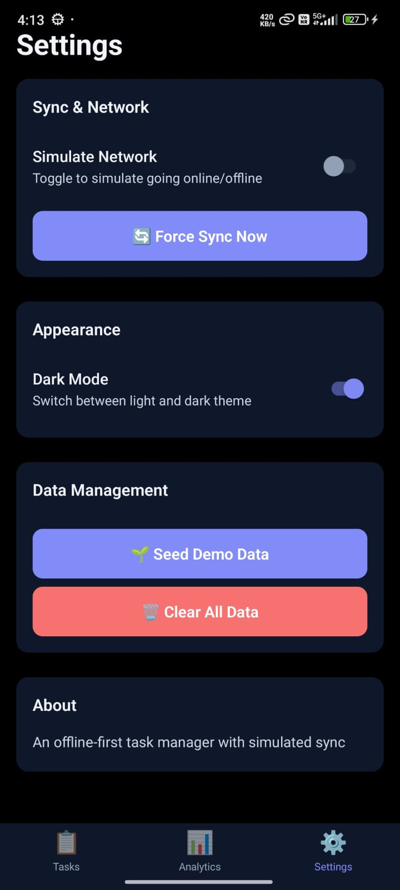
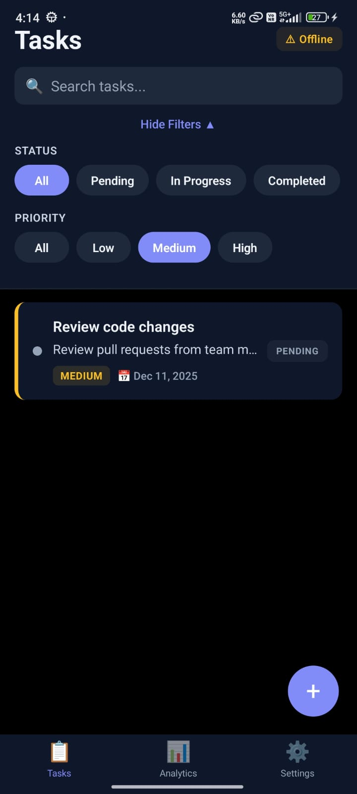
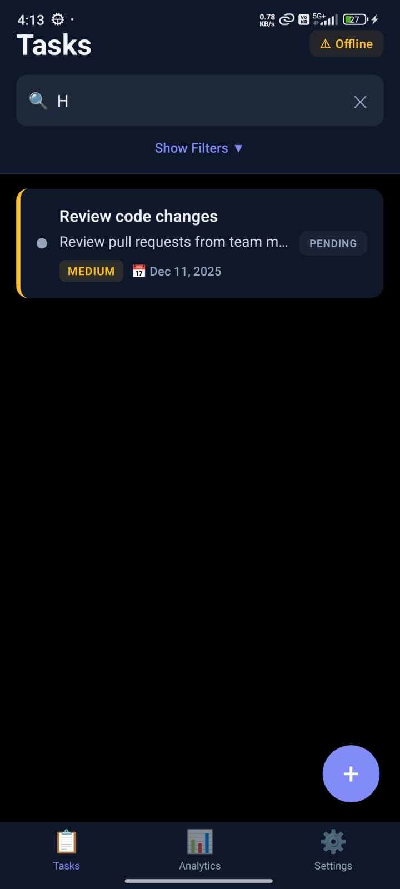

# Task Tracker App 📱

A beautiful, offline-first task manager built with React Native and Expo. Manage your tasks seamlessly, even without an internet connection, with automatic sync when you're back online.

## 🔗 Links

- **GitHub Repository**: [https://github.com/Kishan89/SmartTasks_Mobile](https://github.com/Kishan89/SmartTasks_Mobile)
- **Demo Videos & Code Walkthrough**: [Google Drive](https://drive.google.com/drive/folders/1es3uz2co14Yce7JEdSwwmhjpVVpmcjiS?usp=sharing)

## 📸 Screenshots

<div align="center">

### Main Screens

  

### Features in Action

  

### Empty State


</div>

## ✨ Features

### Core Functionality
- **📝 Task Management**: Create, edit, and delete tasks with ease
- **👆 Swipe Gestures**: Swipe right to complete, swipe left to delete
- **🔍 Smart Search**: Find tasks instantly by title
- **🎯 Filters**: Filter by status (pending, in progress, completed) or priority (low, medium, high)
- **📊 Analytics**: Visual charts showing task breakdown by status and priority

### Offline-First Architecture
- **💾 Local Storage**: All data persists locally using AsyncStorage
- **🔄 Smart Sync**: Changes queue up when offline and sync automatically when online
- **⚡ Instant Updates**: No waiting - all actions happen immediately
- **🔀 Conflict Resolution**: Last-writer-wins strategy for handling conflicts

### User Experience
- **🌙 Dark Mode**: Beautiful light and dark themes with smooth transitions
- **🎨 Modern UI**: Clean, matte design with subtle shadows and smooth animations
- **📱 Responsive**: Works perfectly on all screen sizes
- **🚀 Fast**: Optimized selectors prevent unnecessary re-renders


## 🛠 Tech Stack

| Technology | Why We Chose It |
|------------|----------------|
| **React Native + Expo** | Cross-platform development with zero native configuration |
| **TypeScript** | Type safety catches bugs before runtime |
| **Redux Toolkit** | Predictable state management with excellent TypeScript support |
| **AsyncStorage** | Reliable local persistence that works out-of-the-box with Expo |
| **React Navigation** | Industry-standard navigation with native performance |
| **Gesture Handler** | Smooth swipe gestures for intuitive interactions |

## 🚀 Getting Started

### Prerequisites
- Node.js 18 or higher
- npm or yarn
- Expo Go app on your phone (iOS/Android) OR an emulator

### Installation

```bash
# Clone the repository
git clone https://github.com/Kishan89/SmartTasks_Mobile.git
cd task_app

# Install dependencies
npm install

# Start the development server
npx expo start
```

### Running the App

Once the server starts, you have three options:

1. **📱 Expo Go (Easiest)**
   - Install Expo Go from App Store or Play Store
   - Scan the QR code shown in terminal

2. **🤖 Android Emulator**
   - Press `a` in the terminal

3. **🍎 iOS Simulator** (macOS only)
   - Press `i` in the terminal

## 📖 How to Use

### Testing Offline Functionality

1. Open the app and navigate to **Settings**
2. Keep "Simulate Network" **OFF** (this simulates being offline)
3. Create, edit, or delete tasks - everything works!
4. Toggle "Simulate Network" **ON** to go "online"
5. Watch the sync status indicator update as changes sync

### Swipe Actions

- **Swipe Right** → Mark task as complete (or undo completion)
- **Swipe Left** → Delete task (with confirmation)

### Quick Demo

1. **Seed Data**: Go to Settings → Tap "Seed Demo Data" to add 5 sample tasks
2. **Try Filters**: Use the filter chips to view tasks by status or priority
3. **Search**: Type in the search bar to find specific tasks
4. **Analytics**: Check the Analytics tab to see task breakdown charts
5. **Dark Mode**: Toggle dark mode in Settings for a different look

## 🏗 Project Structure

```
src/
├── api/              # Simulated backend + API client abstraction
├── components/       # Reusable UI components (TaskListItem, Charts, etc.)
├── hooks/            # Custom React hooks (useTaskActions)
├── navigation/       # React Navigation setup (bottom tabs + stack)
├── screens/          # Main app screens (Tasks, Analytics, Settings)
├── storage/          # AsyncStorage wrapper with type-safe helpers
├── store/            # Redux Toolkit slices (tasks, sync, settings)
├── sync/             # Sync manager with outbox pattern
├── theme/            # Color palettes and theme context
├── types/            # TypeScript interfaces and types
└── utils/            # Helper functions (date formatting, etc.)
```

## 🔄 How Sync Works

The app uses an **outbox pattern** for reliable offline sync:

1. **Offline Actions**: When you create/edit/delete a task offline, the change is:
   - Applied immediately to local state
   - Saved to AsyncStorage
   - Added to an "outbox" queue

2. **Going Online**: When network is available:
   - Sync manager processes the outbox queue
   - Each change is sent to the server sequentially
   - Failed changes retry up to 3 times

3. **Conflict Resolution**: Uses "last-writer-wins" based on timestamps

## 🎨 Features Showcase

### Swipe Gestures
Intuitive swipe actions make task management quick and natural.

### Analytics Dashboard
Visual charts show your productivity at a glance - total tasks, completion rate, and breakdowns by status and priority.

### Dark Mode
A beautiful dark theme that's easy on the eyes, with all colors carefully chosen for readability.

## 🧪 Testing

```bash
# Run unit tests
npm test
```

Tests cover:
- Redux reducers (task CRUD operations)
- Sync manager (outbox processing, retries)

## 📝 Environment Variables

Create a `.env` file (see `.env.example`):

```env
# API Mode: 'simulated' or 'real'
API_MODE=simulated

# For real API mode
API_BASE_URL=https://your-api.com

# Simulated server settings
SIMULATED_LATENCY_MS=500
SIMULATED_FAILURE_RATE=0.2
```

## 🚧 Known Limitations

- **Network Detection**: Uses manual toggle instead of actual connectivity detection
- **Date Picker**: Uses text input for dates (native picker would require additional setup)
- **Push Notifications**: Not implemented (would require Expo push notification setup)

## 🔮 Future Enhancements

- Real network connectivity detection
- Native date/time picker
- Task categories and tags
- Push notifications for due dates
- Task attachments and images
- Recurring tasks
- Task sharing and collaboration

## 📄 License

MIT

## 🙏 Acknowledgments

Built as a demonstration of offline-first mobile app architecture with React Native and Expo.

---

**Made with ❤️ using React Native + Expo**